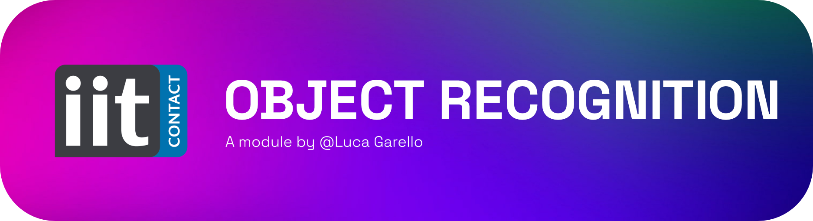
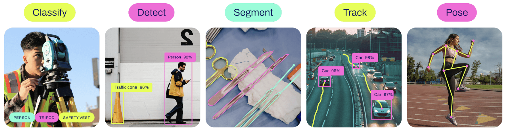

<div align="center">
  <p>
    <a align="center" href="" target="_blank">
      
    </a>
  </p>

  [](https://github.com/roboflow/supervision/blob/main/LICENSE.md)
  [](https://badge.fury.io/py/supervision)

</div>
This module is a YARP implementation of Ultralytics' family of [YOLO MODELS](https://docs.ultralytics.com).
The tasks performed by the pipeline are:

- Object Detection
- Face Detection
- Segmentation
- Pose/Keypoints Detection
 
| Parameters         | Type   | Description                                                                                       | Default      |
|--------------------|--------|---------------------------------------------------------------------------------------------------|--------------|
| --task             | string | recognition task: detection/face_detection/pose/segmentation/                                     | detection    |
| --size             | string | size of the model                                                                                 | n            |
| --annotator        | string | image annotator                                                                                   | BoundingBox  | 
| --classes          | string | classes to recognize e.g."0 3 25", by default all classes are recognized                          | ""           | 
| --conf_threshold   | float  | confidence threshold for detection                                                                | 0.5          |
| --demo             | bool   | run in demo mode                                                                                  | False        |
| --help, -h         |        | show this help message and exit                                                                   |              |

# 🎠 Model Zoo

<div align="center">
  <p>
    <a align="center" href="" target="_blank">
      
    </a>
  </p>
</div>


|       Task     | Model Name    | Available Model Sizes | 
|----------------|---------------|-----------------------|
|  Detection     | YOLOv8        | n, s, m, l, x         | 
| Segmentation   | YOLOv8-seg    | n, s, m, l, x         | 
| Pose/Keypoints | YOLOv8-pose   | n, s, m, l, x         | 
| Classification | YOLOv8-cls    | n, s, m, l, x         |
| Face detection | YOLOv8-face   | n, m, l               |

Additionally it is possible to use foundation models (like CLIP and SAM).
More info on the models can be found [here](https://github.com/ultralytics/ultralytics)

# 🎪 DEMO mode
For your convenience, an .xml app is installed under the name `:DEMO_ObjectRecogniton`.
When run in demo mode, this app iterates through all the available models and annotators showing the recognition capabilities of the robot.
The DEMO MODE can be activated running the module with the `-demo True` flag. 

# 🎯 Trackers 
⚠️ _THIS FEATURE HAS BEEN PARTIALLY IMPLEMENTED BUT NEVER TESTED_ ⚠️
<details>
<summary> A little preview of what's coming </summary>
It is possible to enable a ByteTrack object to track objects across frames. The tracker is based on the [ByteTrack](https://github.com/ifzhang/ByteTrack) repository.

[ByteTrack](https://github.com/ifzhang/ByteTrack) requires the bounding box on consecutive frames to overlap. This is the only criterion that is taken into account. If you are not able to guarantee this, choose another tracker (not implemented) - one that takes into account the unique features of the object, such as DeepSort () or FairMOT ().

Parameters:

| Name           | Type  | Description                                           | Default |
|----------------|-------|-------------------------------------------------------|---------|
| -track_thresh | float | Detection confidence threshold for track activation.  | 0.2     | 
| -track_buffer | int   | Number of frames to buffer when a track is lost.      | 30      | 
| -match_thresh | float | Threshold for matching tracks with detections.        | 0.8     |
| -frame_rate   | int   | The frame rate of the video.                          | 30      |

</details>

# 💻 Installation

This module is installed using a different approch than the other modules that uses pyinstaller.
Due to the need of loading different models at runtime, the module is installed using a "_shared virtual environment_" approach.

Ready to install? 
clone this repo, ideally in the `\CognitiveInteraction` folder.

```bash
cd ../object_recognition

mkdir build && cd build

cmake .. /
make install
```

Easy right? But wait, what happend?
1) We created a _virtual env_ in the build folder.
2) An executable .sh script has been added to the iCubContrib folder. This script activates the virtual env and runs the module.

Now every time you modify your code placed in `\CognitiveInteraction` all the the changes have immediate effect on the main application.

**NO NEED TO REBUILD/PYINSTALL THE WHOLE PROJECT.** 😎

## 📝 Output Description Format
Different tasks have different output formats, here we describe them.

<details>
<summary>DETECTION and FACE DETECTION</summary>


```
message(List):
0: object(List):
     0: id(String)
     1: score(Float64)
     2: coordinates(List)
         0: box_left(Int32)
         1: box_top(Int32)
         2: box_right(Int32)
         3: box_bottom(Int32)
```
</details>


<details>
<summary>CLASSIFICATION</summary>

```
message(List):
0: object(List):
    0: id(String)
    1: score(Float64)
```
</details>

<details>
<summary>POSE DETECTION</summary>

```
message(List):
0: object(List):
     0: id(String)
     1: score(Float64)
     2: keypoints(List)
         0: keypoint_0(List)
            0: keypoint_0_x(Float64)
            1: keypoint_0_y(Float64)
         ...
         17: keypoint_17(List)
           0: keypoint_17_x(Float64)
           1: keypoint_17_y(Float64)
```
</details>

## Authors and acknowledgment
This project is run by Luca Garello (luca.garello@iit.it).

## License
This code is released under MIT-License.
Yolo's model weights are released under different licensing options. see more [here](https://www.ultralytics.com/it/license).
 
