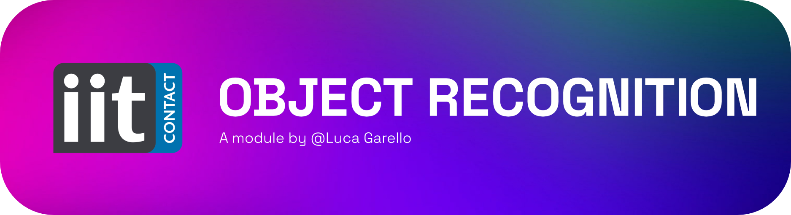

<!-- <div align="center">
  <p>
    <a align="center" href="" target="_blank">
      
    </a>
  </p>

  [](https://github.com/roboflow/supervision/blob/main/LICENSE.md)
  [](https://badge.fury.io/py/supervision)

</div> -->

A text 2 speech based on Microsoft's edge-tts.
this module stems from the need to use alternative voices to AcapelaSpeak in a totally free way.
__WARNING:__ 
- It's still uncertain if we want to support this module. Acapela is great!
- An online connection is required
- Currently we do not support bookmarking and mouth movements while speaking.

# 💻 Installation

This module is installed using a different approch than the other modules that uses pyinstaller.
Due to the need of loading different models at runtime, the module is installed using a "_shared virtual environment_" approach.

Ready to install? 
clone this repo, ideally in the `\CognitiveInteraction` folder.

```bash
cd ../text2speech

mkdir build && cd build

cmake .. /
make install
```

Easy right? But wait, what happend?
1) We created a _virtual env_ in the build folder.
2) An executable .sh script has been added to the iCubContrib folder. This script activates the virtual env and runs the module.

Now every time you modify your code placed in `\CognitiveInteraction` all the the changes have immediate effect on the main application.

**NO NEED TO REBUILD/PYINSTALL THE WHOLE PROJECT.** 😎


## Authors and acknowledgment
This project is run by Luca Garello (luca.garello@iit.it).

## License
This code is released under MIT-License.
Yolo's model weights are released under different licensing options. see more [here](https://www.ultralytics.com/it/license).
 
